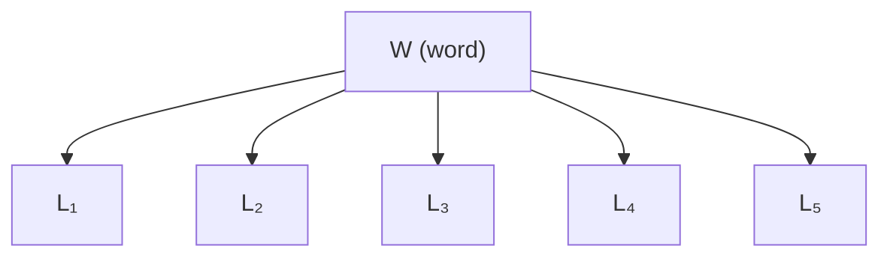

# Hangman 

Consider the belief network shown below, where the random variable $W$ stores a five-letter word and the random variable $L_i \in \{\texttt{A}, \texttt{B}, \ldots, \texttt{Z}\}$ reveals only the word’s $i$th letter. Suppose that these five-letter words are chosen at random from a large corpus of text according to their frequency:

$$
P(W = w) = \frac{\text{count}(w)}{\sum_{w'} \text{count}(w')},
$$

where $\text{count}(w)$ denotes the number of times that $w$ appears in the corpus and the denominator is a sum over all five-letter words. In this model the conditional probability tables for the random variables $L_i$ are particularly simple:

$$
P(L_2 = \ell \ \text{or} \ L_4 = \ell \mid W = w) =
\begin{cases}
1 \quad \text{if } \ell \text{ is the second or fourth letter of } w \\
0 \quad \text{otherwise}
\end{cases}
$$

Now imagine a game in which you are asked to guess the word $w$ one letter at a time. After each letter ($\texttt{A}$ through $\texttt{Z}$) that you guess, you are told whether the letter appears in the word and where it appears. Given the **evidence** you have at any stage, the critical question is what letter to guess next.

## Belief network

*(If you add a figure file to the repo, you can embed it with ``.)*

## Example

Suppose that after three guesses—the letters $\texttt{D}$, $\texttt{I}$, $\texttt{M}$—you learn that $\texttt{I}$ does **not** appear, and that $\texttt{D}$ and $\texttt{M}$ appear as follows:

**Pattern:** `M` `_` `D` `_` `M` (positions 1, 3, and 5 are known; 2 and 4 are blank.)

Consider your next guess, call it $\ell$. In this game a natural goal is the letter $\ell$ that maximizes

$$
P\big(L_2 = \ell \ \text{or}\ L_4 = \ell \ \big|\ L_1 = \texttt{M},\, L_3 = \texttt{D},\, L_5 = \texttt{M},\, L_2 \notin \{\texttt{D}, \texttt{I}, \texttt{M}\},\, L_4 \notin \{\texttt{D}, \texttt{I}, \texttt{M}\}\big).
$$

In other words, pick the letter $\ell$ that is most likely to appear in the blank (unguessed) positions. For any letter $\ell$ you can compute this probability as follows:

$$
\begin{gathered}
P\big(L_2 = \ell \ \text{or}\ L_4 = \ell \ \big|\ L_1 = \texttt{M},\, L_3 = \texttt{D},\, L_5 = \texttt{M},\, L_2 \notin \{\texttt{D}, \texttt{I}, \texttt{M}\},\, L_4 \notin \{\texttt{D}, \texttt{I}, \texttt{M}\}\big) \\
\quad = \sum_w P\big(W = w,\, L_2 = \ell \ \text{or}\ L_4 = \ell \ \big|\ L_1 = \texttt{M},\, \ldots\big) \quad \text{(marginalization)} \\
\quad = \sum_w P(W = w \mid \text{evidence})\, P(L_2 = \ell \ \text{or}\ L_4 = \ell \mid W = w) \quad \text{(product rule and CI)}
\end{gathered}
$$

where the last step uses **conditional independence** of the letters $L_i$ given the word $W$. The second factor in the sum is straightforward:

$$
P(L_2 = \ell \text{ or } L_4 = \ell \mid W = w) =
\begin{cases}
1 & \text{if } \ell \text{ is the second or fourth letter of } w \\
0 & \text{otherwise}
\end{cases}
$$

The first factor comes from Bayes’ rule:

$$
P(W = w \mid L_1 = \texttt{M},\, L_3 = \texttt{D},\, L_5 = \texttt{M},\, L_2 \notin \{\texttt{D}, \texttt{I}, \texttt{M}\},\, L_4 \notin \{\texttt{D}, \texttt{I}, \texttt{M}\})
$$

$$
= \frac{P(L_1 = \texttt{M},\, L_3 = \texttt{D},\, L_5 = \texttt{M},\, L_2 \notin \{\texttt{D}, \texttt{I}, \texttt{M}\},\, L_4 \notin \{\texttt{D}, \texttt{I}, \texttt{M}\} \mid W = w)\, P(W = w)}
{P(L_1 = \texttt{M},\, L_3 = \texttt{D},\, L_5 = \texttt{M},\, L_2 \notin \{\texttt{D}, \texttt{I}, \texttt{M}\},\, L_4 \notin \{\texttt{D}, \texttt{I}, \texttt{M}\})} \quad \text{(Bayes’ rule)}
$$

In the numerator, the likelihood term is 0 or 1 depending on whether the evidence is compatible with $w$, and $P(W = w)$ is the prior from empirical frequencies. The denominator is

$$
\begin{gathered}
P(L_1 = \texttt{M},\, L_3 = \texttt{D},\, L_5 = \texttt{M},\, L_2 \notin \{\texttt{D}, \texttt{I}, \texttt{M}\},\, L_4 \notin \{\texttt{D}, \texttt{I}, \texttt{M}\}) \\
\quad = \sum_w P(W = w)\, P(L_1 = \texttt{M},\, \ldots \mid W = w) \quad \text{(marginalization, product rule)}
\end{gathered}
$$

with the usual 0/1 factors inside the sum. The denominator is therefore the sum of empirical frequencies of all words compatible with the observed evidence.

## General case

Let $E$ denote the evidence at some intermediate round: some letters are revealed in place, others are known to be absent. Two computations matter.

**Posterior** (Bayes’ rule):

$$
P(W = w \mid E) = \frac{P(E \mid W = w)\, P(W = w)}{\sum_{w'} P(E \mid W = w')\, P(W = w')}.
$$

**Predictive** probability that letter $\ell$ appears somewhere in the word:

$$
P\big(\exists\, i \in \{1,2,3,4,5\} : L_i = \ell \ \big|\ E\big)
= \sum_w P\big(\exists\, i : L_i = \ell \ \big|\ W = w\big)\, P(W = w \mid E).
$$

The posterior feeds into this predictive step. Your assignment is **to implement** both of these calculations.

---

## Starter code

Open this repository in Colab from the **Open in Colab** button in the README (if provided). The starter codebase includes:

| File | Description |
|------|-------------|
| `hw1_word_counts_05.txt` | Five-letter words (including names and proper nouns) and counts from a large Wall Street Journal corpus (on the order of three million sentences). |
| `hangman.py` | Game engine: loads the word list, parses frequencies, runs the game. |
| `CSE150A_Hangman_HW1.ipynb` | Notebook for you to complete. |

## Problems

1. **(a)** Play a few games of hangman using the corresponding notebook cell to see how the game works. *(0 pts)*

2. **(b)** Implement a **random** play mode that returns a uniformly random letter from the alphabet that has not been guessed yet. **(2 pts)**

3. **(c)** Implement the **Bayesian inference** function that picks the next most likely letter using the word list, following the reasoning above. Documentation is in the notebook cell. *(8 pts)*

4. **(d)** Implement a **benchmark** function (per notebook documentation) that compares random vs. Bayesian play.  
   **Note:** A strong solution typically reaches **at least ~94%** accuracy over 1000 games on average; aim for **at least ~93%** over 1000 tries for full credit. *(3 pts)*

5. **(e)** Export the notebook per the [course export instructions](https://ucsd-cse150a-w25.github.io/export.html), with outputs included. Submit a **single** PDF containing your writeup (scanned or typed) and the exported notebook PDF. Format issues may cost up to 2 points. *(0 pts)*
